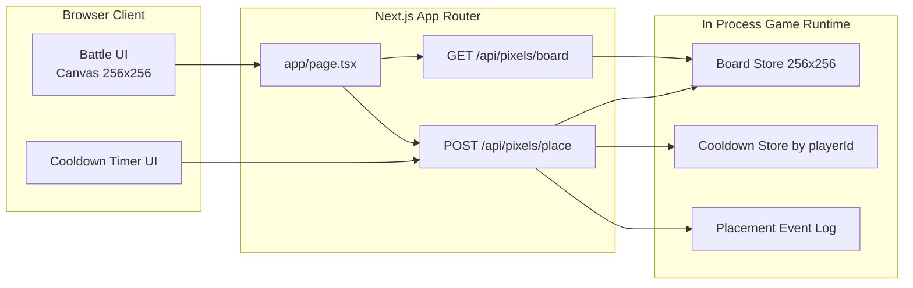
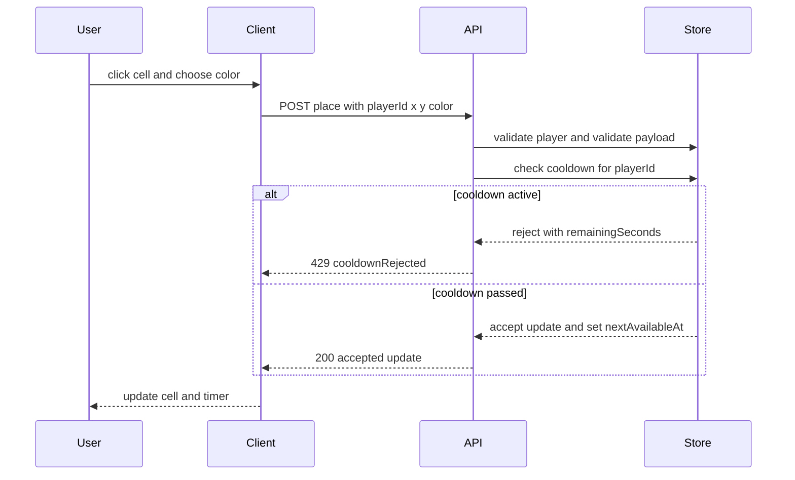
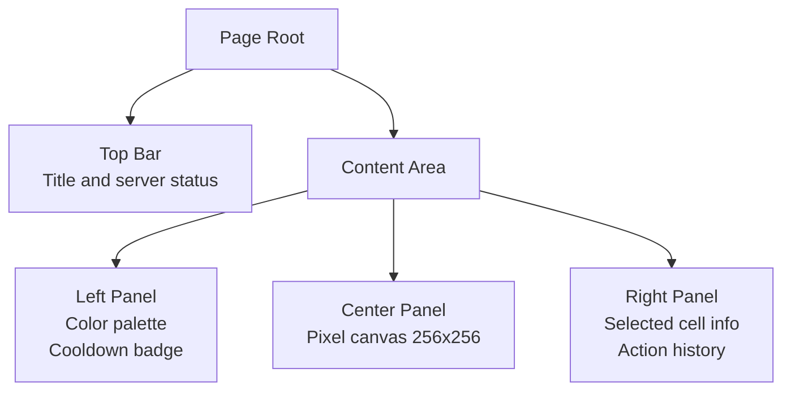

# Design Document

## Overview

Этот дизайн описывает реализацию Pixel Battle в формате общей доски 256x256 для неограниченного числа одновременных игроков с серверным правилом: один успешный пиксель раз в 10 секунд на игрока. Веб-интерфейс остается в Next.js App Router, а серверные операции размещения и чтения состояния реализуются через Route Handlers.

## Existing Code References

| File path            | Purpose                              | Impact           |
| -------------------- | ------------------------------------ | ---------------- |
| app/page.tsx         | Текущая главная страница             | will be modified |
| app/page.module.scss | Текущие стили главной страницы       | will be modified |
| app/layout.tsx       | Корневой layout и metadata           | read-only        |
| app/globals.css      | Глобальные стили приложения          | read-only        |
| next.config.ts       | Базовая конфигурация Next.js         | read-only        |
| tsconfig.json        | Конфигурация TypeScript и alias @/\* | read-only        |

## Current Architecture Analysis

- Проект использует Next.js App Router с файловой маршрутизацией в каталоге app.
- Главный экран рендерится через app/page.tsx и модульные стили app/page.module.scss.
- Route Handlers для игрового API в app/api/\* отсутствуют.
- Слой игровых типов и сервисов отсутствует.
- Реалтайм канал отсутствует, поэтому текущий код не покрывает R3.
- Идентификация игрока и серверный cooldown отсутствуют, поэтому текущий код не покрывает R2 и R4.

## Architecture

Архитектура делится на три зоны:

1. Клиентский слой: отрисовка доски 256x256, выбор цвета, клик по пикселю, локальный countdown.
2. API слой в Next.js Route Handlers: валидация координат и цвета, проверка cooldown, запись пикселя, выдача состояния.
3. In-memory игровой store процесса: состояние доски, таймеры cooldown, лента событий для короткой истории и диагностики.

### Architecture Diagram



## Components and Interfaces

### Клиентские компоненты

- HomePage в app/page.tsx: контейнер страницы и orchestration загрузки доски.
- PixelCanvas в app/components/pixel-canvas.tsx: рендер 256x256 и обработка клика клетки.
- ColorPalette в app/components/color-palette.tsx: выбор разрешенного цвета.
- CooldownBadge в app/components/cooldown-badge.tsx: состояние таймера до следующей установки.

### Серверные интерфейсы

- GET /api/pixels/board
  - Назначение: отдать текущее состояние доски и серверное время.
  - Ответ 200: board, palette, serverTime.
- POST /api/pixels/place
  - Назначение: попытка поставить пиксель от имени playerId.
  - Тело: playerId, x, y, color.
  - Ответ 200: accepted update и nextAvailableAt.
  - Ответ 429: cooldownRejected с remainingSeconds.
  - Ответ 400: validationError.
  - Ответ 401: unauthorized.

### Sequence Diagram



## Data Models

Новые модели данных:

- BoardCell: состояние одной клетки.
- PlacePixelRequest: вход запроса установки.
- PlacePixelResult: результат проверки и применения.
- CooldownState: доступность действия по playerId.

```ts
// types/pixel.ts // new
export type PixelColor =
  | "#111111"
  | "#f8fafc"
  | "#ef4444"
  | "#3b82f6"
  | "#22c55e"
  | "#eab308";

export type PlacePixelRequest = {
  playerId: string;
  x: number;
  y: number;
  color: PixelColor;
};

export type PlacePixelResult =
  | { ok: true; nextAvailableAt: number }
  | { ok: false; code: "COOLDOWN"; remainingSeconds: number }
  | { ok: false; code: "VALIDATION"; message: string };
```

```ts
// services/pixel/constants.ts // new
export const BOARD_SIZE = 256;
export const COOLDOWN_SECONDS = 10;
```

## Proposed Architecture Changes

Изменяемые файлы:

- app/page.tsx: замена демо-контента на игровой экран Pixel Battle.
- app/page.module.scss: стили игрового интерфейса, панели палитры и доски.

Новые файлы:

- app/api/pixels/board/route.ts: выдача доски.
- app/api/pixels/place/route.ts: установка пикселя с cooldown.
- app/components/pixel-canvas.tsx: сетка и клик клетки.
- app/components/color-palette.tsx: палитра.
- app/components/cooldown-badge.tsx: таймер cooldown.
- services/pixel/store.ts: in-memory состояние доски и player cooldown.
- services/pixel/validation.ts: проверка координат и цвета.
- services/pixel/player-id.ts: извлечение playerId из cookie или заголовка.
- types/pixel.ts: типы домена.

### Route Handler Example

```ts
// app/api/pixels/place/route.ts // new
import { NextResponse } from "next/server";
import { applyPlacement } from "@/services/pixel/store";
import { readPlayerId } from "@/services/pixel/player-id";

export async function POST(request: Request) {
  const playerId = readPlayerId(request);

  if (!playerId) {
    return NextResponse.json({ code: "UNAUTHORIZED" }, { status: 401 });
  }

  const payload = await request.json();
  const result = applyPlacement({ ...payload, playerId });

  if (!result.ok && result.code === "COOLDOWN") {
    return NextResponse.json(result, { status: 429 });
  }

  if (!result.ok) {
    return NextResponse.json(result, { status: 400 });
  }

  return NextResponse.json(result, { status: 200 });
}
```

## GUI Design Changes

### GUI Layout Sketch



### Controls List

| Control              | Role                     | Icon  | aria-label          |
| -------------------- | ------------------------ | ----- | ------------------- |
| Canvas cell button   | Клик по клетке           | none  | Place pixel at X Y  |
| Palette color swatch | Выбор цвета              | none  | Select color VALUE  |
| Place action button  | Подтверждение установки  | dot   | Place pixel         |
| Cooldown badge       | Информирование о таймере | clock | Cooldown remaining  |
| Selected cell info   | Информация о координатах | pin   | Selected coordinate |

### Interaction States

- Canvas cell: default, hover, focus, active.
- Palette swatch: default, hover, focus, selected, disabled.
- Place action button: default, hover, focus, disabled during cooldown.
- Cooldown badge: idle and counting.

### Accessibility Notes

- Все интерактивные элементы доступны по Tab и активируются через Enter или Space.
- Для выбранной клетки и выбранного цвета используется aria-live region с короткими обновлениями.
- Фокус-обводка видима при клавиатурной навигации.
- Цвет не используется как единственный канал: выбранный цвет подтверждается текстовым именем.
- Empty state: если доска не загружена, показывается placeholder и кнопка повторной загрузки.
- Error state: при ошибке API показывается машиночитаемый код и кнопка retry.

## Error Handling

- VALIDATION_COORDINATE: x или y вне диапазона 0..255, ответ 400.
- VALIDATION_COLOR: цвет не входит в палитру, ответ 400.
- UNAUTHORIZED: отсутствует playerId, ответ 401.
- COOLDOWN: игрок пытается поставить пиксель раньше 10 секунд, ответ 429 с remainingSeconds.
- INTERNAL: непредвиденная ошибка обработчика, ответ 500 с безопасным сообщением.

## Testing Strategy

1. Unit tests для services/pixel/validation.ts:
   - валидные и невалидные координаты;
   - валидные и невалидные цвета.
2. Unit tests для services/pixel/store.ts:
   - успешная установка;
   - отклонение по cooldown;
   - следующая установка после 10 секунд.
3. Integration tests для app/api/pixels/place/route.ts:
   - 200 при валидном запросе;
   - 429 при cooldown;
   - 401 без playerId;
   - 400 при некорректном payload.
4. UI tests для app/page.tsx:
   - отображение 256x256;
   - блокировка кнопки во время cooldown;
   - визуальное обновление клетки после успешного ответа.

## Implementation Sequence

1. Добавить доменные типы и константы доски и cooldown.
2. Реализовать validation слой координат и цветов.
3. Реализовать in-memory store с cooldown-проверкой.
4. Добавить Route Handlers board и place.
5. Обновить app/page.tsx и app/page.module.scss под игровой интерфейс.
6. Добавить клиентские компоненты Canvas, Palette, CooldownBadge.
7. Добавить тесты unit и integration.

## Migration Strategy

- Главная страница полностью переключается с стартового шаблона на экран игры.
- Обратная совместимость API не требуется, так как endpoint-ы создаются впервые.
- Для безопасного rollout включается feature flag PIXEL_BATTLE_ENABLED со значением true по умолчанию в dev среде.

## Performance Considerations

- Размер доски фиксирован 256x256, что ограничивает верхнюю границу данных состояния.
- На клиенте отрисовка выполняется батчами по кадрам через requestAnimationFrame.
- POST place endpoint выполняет O(1) операции по карте и cooldown индексу.
- GET board возвращает компактный формат состояния без избыточных метаданных.

## Security Considerations

- Серверный источник истины для cooldown и размещения пикселя.
- Нельзя доверять client-side таймеру при принятии решения.
- Валидация всех входных полей в Route Handlers.
- Ограничение частоты запросов по playerId и IP.
- В ответах ошибок не публикуются внутренние структуры runtime store.

## Maintenance Considerations

- Доменные типы вынесены в types/pixel.ts.
- Логика проверки и логика хранения разделены по сервисам.
- API-контракты фиксированы и пригодны для будущего выноса realtime слоя в отдельный сервис.
- Тесты на validation и cooldown предотвращают регрессии в ключевом игровом правиле.

## Traceability

| Requirement | Design coverage                                                             |
| ----------- | --------------------------------------------------------------------------- |
| R1          | Architecture, Data Models, GUI Design Changes, Testing Strategy             |
| R2          | Components and Interfaces, Error Handling, Testing Strategy                 |
| R3          | Architecture Diagram, Sequence Diagram, Proposed Architecture Changes       |
| R4          | Components and Interfaces, Security Considerations, Error Handling          |
| R5          | Proposed Architecture Changes, Testing Strategy, Maintenance Considerations |

## Risks & Mitigations

1. Риск: in-memory store теряет состояние при рестарте процесса.
   Митигация: периодически добавлять snapshot в постоянное хранилище на следующем этапе.
2. Риск: массовые запросы на place перегружают один процесс.
   Митигация: добавить rate limiting и профильные метрики latency/error per route.
3. Риск: визуальная производительность падает при полном перерисовывании доски.
   Митигация: инкрементальная отрисовка измененных клеток и батчинг в requestAnimationFrame.
